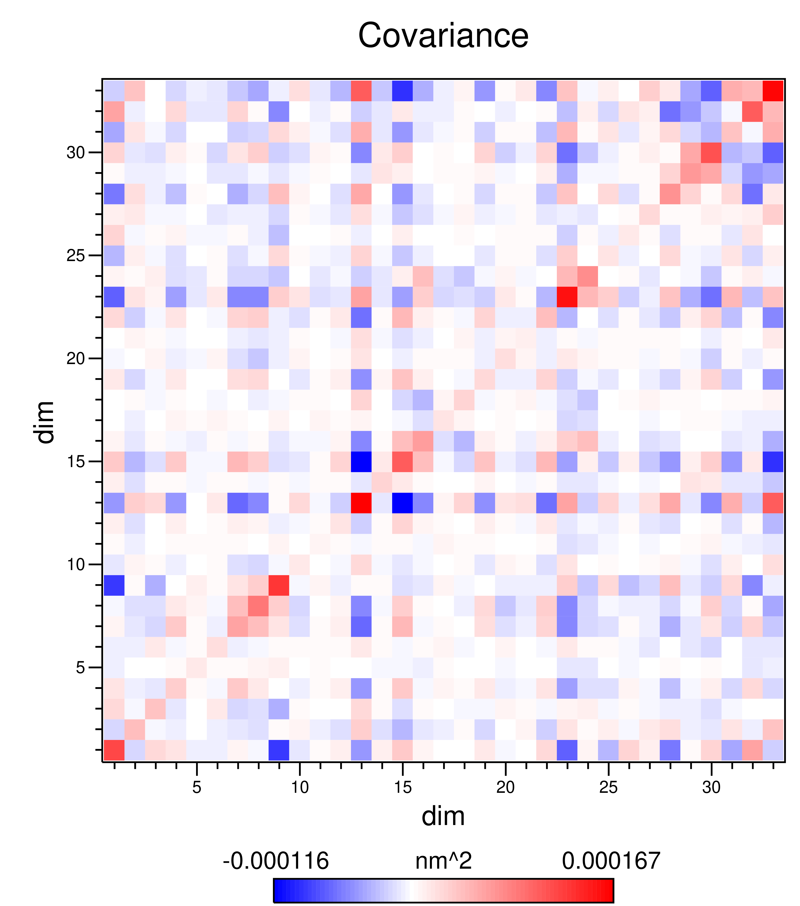
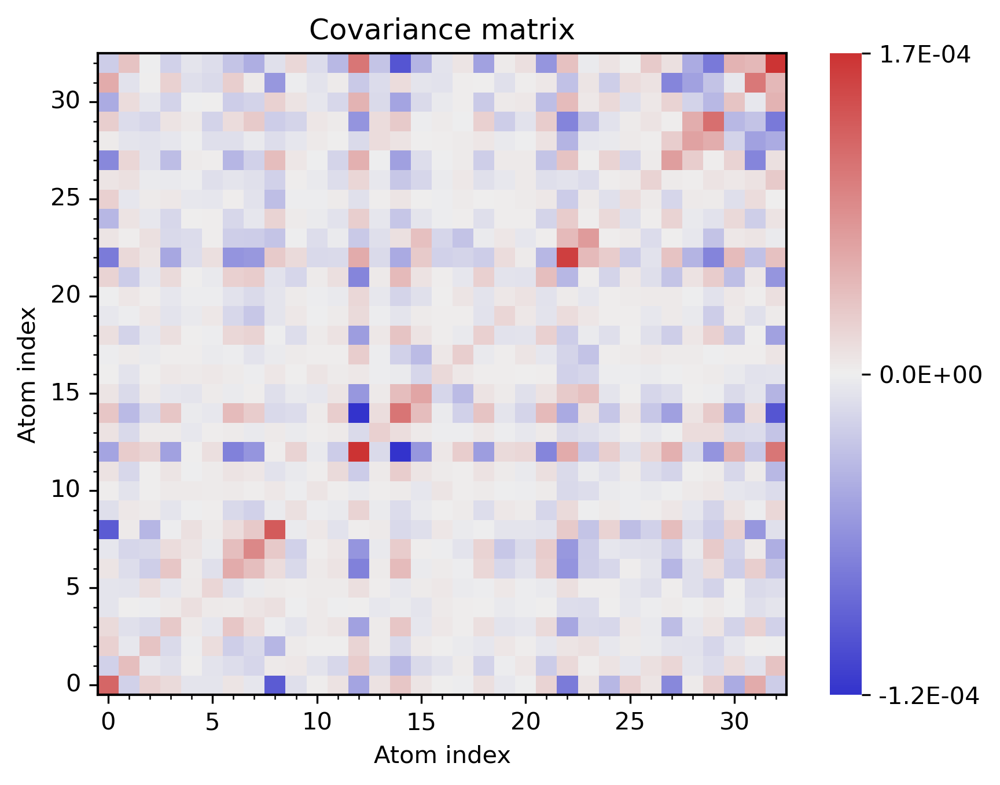
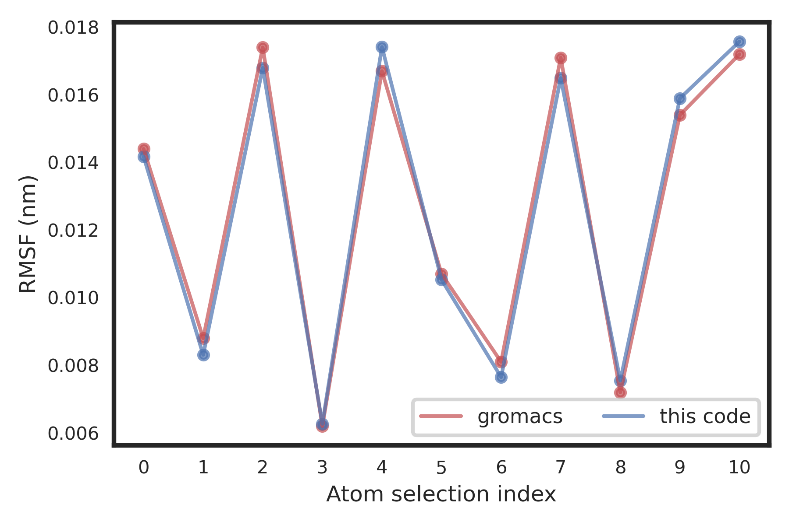
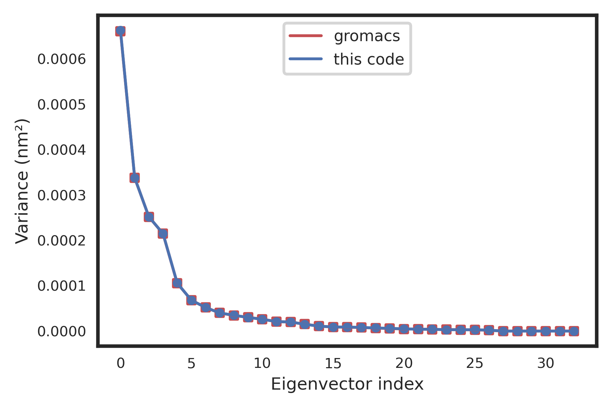
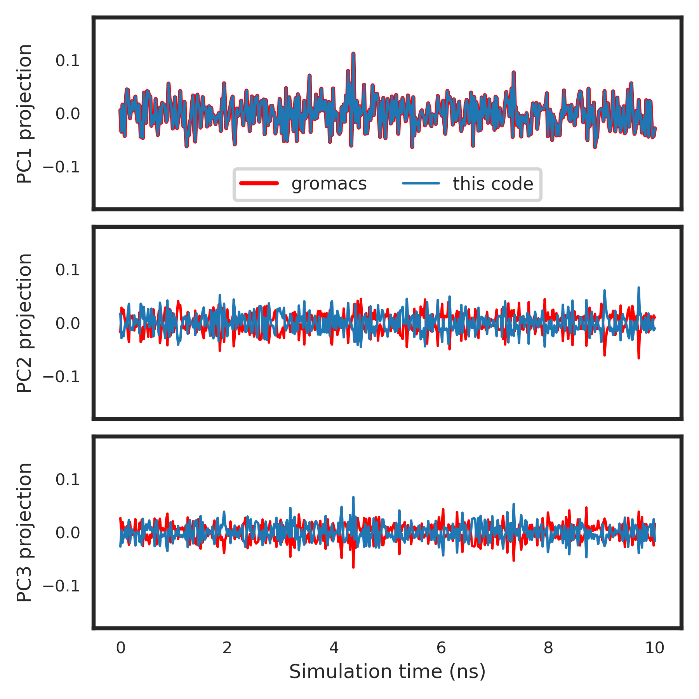
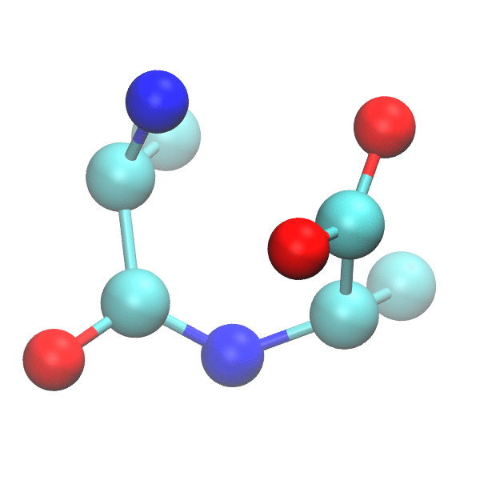
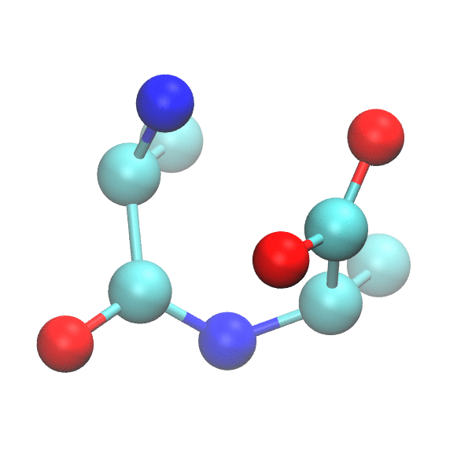
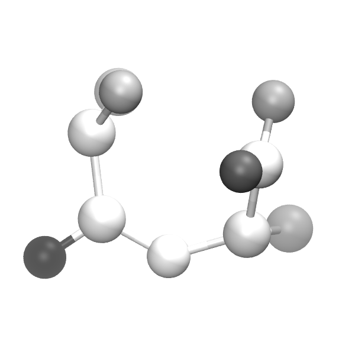

# About the program

This is an efficient implementation of PCA calculations for MD trajectories based on 
scikit-learn library. Structural processing is done by mdtraj and several interesting 
features were implemented:

* Trajectory centering/fitting using mdtraj selection scheme;
* PCA calculation for specific atoms, according to another mdtraj selection;
* All eingenvalues/eigenvectors are computed (correct eigenvalue normalization), but:
   * Only the top N eingenvalues (projections) are written (user-defined);
   * Only the top N eigenvectors (pseudotrajectories) are written (user-defined);
* Pseudotrajectores are written with user-defined scaling factors;
* The eigenvector norm for each atom is written at the B-factor of pseudotrajectory files;
* The covariance matrix is written in both ASCII and PNG formats;
* The RMSF (for the real trajectory) of the selection is obtained from the covariance matrix;

Please check the results carefully. There is no warranties.

# General instructions

## Build a conda environment and install packages

```bash 
   $ conda create -n pca_env python=3.9 

   $ pip install -r requirements.txt

   $ conda activate pca_env
```

The code was tested with the following package versions:

python 3.9.16

numpy 1.24.4

pandas 2.0.3

sklearn 1.3.0

mdtraj 1.9.9

matplotlib 3.7.1

seaborn 0.12.2

## Checking the atom selection for PCA calculations:

It can be tricky to get the correct atomic selection using tools such as mdtraj and PCA calculations can be lengthy for a large number of atoms. To check if the selection is correct, one can run the code using with the **check** command and a .pdb file contain only the selected atoms will be written:

```bash
   (pca_env)$ python3 run_pca.py check \
                      --pdb gmx_results/03_analysis/nvt.pdb \
                      --trj gmx_results/03_analysis/trj_fit.xtc \
                      --fit "not type H" \
                      --sel "not type H" \   
```

## Running calculations:

To run from scratch (**run** command), a suitable trajectory (--trj)  and topology (--pdb) should be provided, along with
the fitting selection (--fit), the calculation selection (--sel), the displacement scaling for the pseudotrajectories
(--dsp) and the number of principal components to write (--num):

```bash 
   (pca_env)$ python3 run_pca.py run \
                      --pdb gmx_results/03_analysis/nvt.pdb \
                      --trj gmx_results/03_analysis/trj_fit.xtc \
                      --fit "not type H" \
                      --sel "not type H" \
                      --dsp 0.1 \
                      --num 3
```


## Re-processing eigenvectors:

To rewrite eigenvectors with different scaling factors (**rescale** command), one must provide the displacement scaling for the pseudotrajectories (--dsp) and the number of principal components written previously (--num). The code must be run in the same directory:

```bash
   (pca_env)$ python3 run_pca.py rescale \
                      --dsp 0.1 --num 3
```

# Results

To validate the code, a short MD trajectory for an alanine dimer was obtained with Gromacs 2024.4. All frames were analyzed and only the heavy atoms were considered, as shown in the **run** command above.
Resulting data were validated using Gromacs 2024.4 *rmsf*, *covar* and *anaeig* tools as the reference. 

## Covariance matrix

<center>
<table>
  <tr>
    <td align="center">
      
      <br>
      <em>Covariance matrix obtained with Gromacs tools.</em>
    </td>
    <td align="center">
      
      <br>
      <em>Covariance matrix obtained with this code.</em>
    </td>
  </tr>
</table>
</center>

## RMSF

Root mean-squared fluctuations were calculated for the MD trajectory using Gromacs *rmsf* tool and also from the diagonal elements of the covariance matrix obtained by Scikit-learn calculation.

<center>
<table>
  <tr>
    <td align="center">
      
      <br>
      <em>RMSF values for the MD trajectory obtained with both methods.</em>
    </td>
  </tr>
</table>
</center>

## Eigenvalues

For each method, the eigenvalues (or the variance of each eigenvector) was also computed and the results are in perfect agreement.

<center>
<table>
  <tr>
    <td align="center">
      
      <br>
      <em>Resulting PCA eigenvalues obtained with both methods.</em>
    </td>
  </tr>
</table>
</center>

## Projections of first three PCs

The projection of the first principal components is in perfect agreement in both methods. Results are exactly the same for eigenvectors #2 and #3, but with opposite sign. It is interesting to notice that PCA calculation rotates the data to arbitrary directions to maximize the variance. Thus, the sign is arbitrary and meaningless. Projections with opposite sign are equivalent, and result in the same interpretations.

<center>
<table>
  <tr>
    <td align="center">
      
      <br>
      <em>Projections of first three principal components obtained with both methods.</em>
    </td>
  </tr>
</table>
</center>

## First eigenvector

<center>
<table>
  <tr>
    <td align="center">
      
      <br>
      <em>Scaled pseudotrajectory for PC1 obtained with Gromacs tools.</em>
    </td>
    <td align="center">
      
      <br>
      <em>Scaled pseudotrajectory for PC1 obtained with this code.</em>
    </td>
  </tr>
</table>
</center>

For each atom, the eigenvector norm was calculated and written to each pseudotrajectory. By selecting the central frame (which corresponded to the average structure), one can set the colors according to the B-factor field and get a static visualization of which atoms are more involved in each eigenvalue. In the example below, white color correspond to | v | = 0 and black color correspond to | v | = 0.6.

<center>
<table>
  <tr>
    <td align="center">
      
      <br>
      <em>Average structure from MD trajectory with atoms colored by eigenvector norm values (this code).</em>
    </td>
  </tr>
</table>
</center>

# Directory organization

* [`example`](./example): Directory containing calculations for alanine dimer
  * [`gmx_results`](./example/gmx_results): MD trajectories and results obtained with gromacs tools (*rmsf*, *colvar* and *anaeig*)
  * [`sklearn_results`](./example/sklearn_results): Results obtained with this code
  * [`all_plots`](./example/all_plots): Python notebook with the plots shown here


